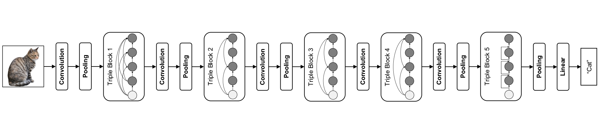

# [Efficient Convolutional Neural Networks on Raspberry Pi for Image Classification](https://arxiv.org/abs/2204.00943)
<p align="center">
  
</p>

## Citation
If you find TripleNet useful in your research, please consider citing:

	@article{TripleNet,
	 title={Efficient Convolutional Neural Networks on Raspberry Pi for Image Classification},
	 author={Rui-Yang Ju, Jen-Shiun Chiang, Jia-Hao Jian, Ting-Yu Lin},
	 year={2022}
	 }
	 
## Contents
1. [Introduction](#introduction)
2. [Usage](#Usage)
3. [Model](#Model)
4. [Results](#Results)
5. [Requirements](#Requirements)
6. [Config](#Config)
7. [References](#References)

## Introduction
TripleNet is adopted from the concept of block connections in ThreshNet, it compresses and accelerates the network model, reduces the amount of parameters of the network, and shortens the inference time of each image while ensuring the accuracy. TripleNet and other state-of-the-art (SOTA) neural networks perform image classification experiments with the CIFAR-10 and SVHN datasets on Raspberry Pi. The experimental results show that, compared with MobileNet, ThreshNet, EfficientNet, and HarDNet, the inference time of TripleNet per image is shortened by 16%, 17%, 24%, and 30%, respectively.

 

## Usage
```bash
python3 main.py
```
optional arguments:

    --lr                default=1e-3    learning rate
    --epoch             default=200     number of epochs tp train for
    --trainBatchSize    default=64     training batch size
    --testBatchSize     default=64     test batch size

pre-training:

    return TripleNet(pretrained=True, weight_path='your pre-trained model address')

## Model
| **Model** | **Layer** | **Channel** | **Growth Rate** |
| :---: | :---: | :---: | :---: |
| TripleNet-S | 6, 16, 16, 16, 2 | 128, 192, 256, 320, 720 | 32, 16, 20, 40, 160 |
| TripleNet-B | 6, 16, 16, 16, 3 | 128, 192, 256, 320, 1080 | 32, 16, 20, 40, 160 |

## Results
| Name | Raspberry Pi 4 Time (ms) | C10 Error (%) | FLOPs (G) | MAdd (G) | Memory (MB) | #Params (M) |
| :---: | :---: | :---: | :---: | :---: | :---: | :---: |
| **TripleNet-S** | 40.6 | 13.05 | 4.17 | 8.32 | 90.25 | 9.67 |
| ShuffleNet | 44.1 | 13.35 | 2.22 | 4.31 | 617.00 | 1.01 |
| ThreshNet-28 | 45.3 | 14.75 | 2.28 | 4.55 | 83.26 | 10.18 |
| **TripleNet-B** | 65.1 | 12.97 | 4.29 | 8.57 | 91.33 | 12.63 |
| MobileNetV2 | 67.4 | 14.06 | 2.42 | 4.75 | 384.78 | 2.37 |
| MobileNet | 76.8 | 16.12 | 2.34 | 4.63 | 230.84 | 3.32 | 
| ThreshNet-95 | 77.9 | 13.31 | 4.07 | 8.12 | 132.34 | 16.19 |
| EfficientNet-B0 | 85.4 | 13.40 | 1.51 | 2.99 | 203.74 | 3.60 | 
| HarDNet-85 | 92.5 | 13.89 | 9.10 | 18.18 | 74.65 | 36.67 |

\* Raspberry Pi Time is the inference time per image on Raspberry Pi 4

## Requirements
#### Raspberry Pi 4 Model B 4GB
* python3 - 3.9.2
* torch - 1.11.0
* torchvision - 0.12
* numpy - 1.22.3

## Config
###### Optimizer 
__Adam Optimizer__
###### Learning Rate
__1e-3__ for [1,74] epochs <br>
__5e-4__ for [75,149] epochs <br>
__2.5e-4__ for [150,200) epochs <br>


## References
* [torchstat](https://github.com/Swall0w/torchstat)
* [pytorch-cifar10](https://github.com/soapisnotfat/pytorch-cifar10)
* [HarDNet](https://github.com/PingoLH/Pytorch-HarDNet)
